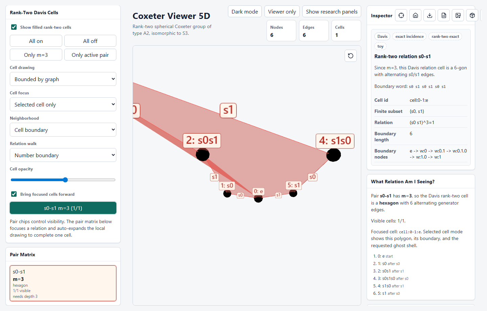
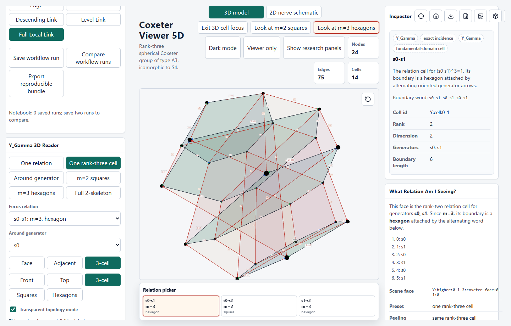
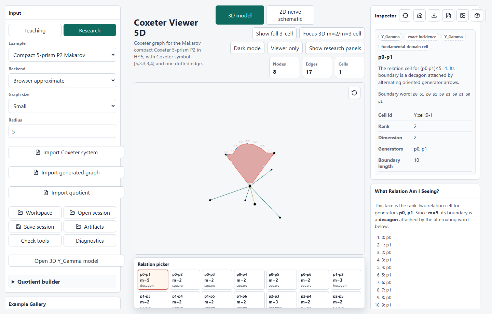
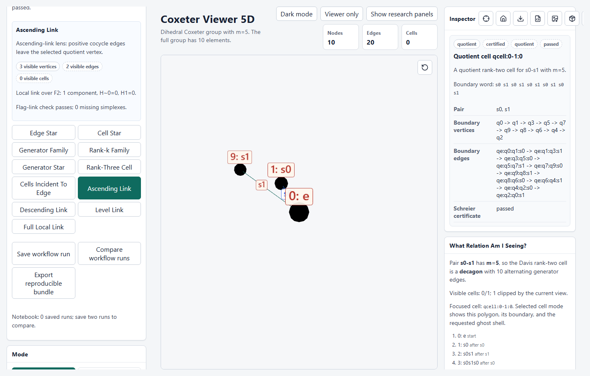

# Walkthroughs

These are presenter scripts for the four public-alpha guided demos. They are
meant to teach inspection habits: name the Coxeter object, show the exact
incidence data, then say which parts of the 3D picture are only a drawing.

The demos are not proofs. Treat the warnings panel, selected-object inspector,
and sidecar/export metadata as part of the mathematical readout.

## Before You Start

Use the named example before starting each guide. Some guided buttons preserve
the current dataset, so a clean public-alpha run should load the example first
and then press the guide button.

Suggested order:

1. `A2`: find a hexagon for one `m = 3` rank-two relation.
2. `A3`: inspect one rank-three spherical cell.
3. `compact_5_prism_makarov_p2`: inspect `Y_Gamma` for the certified P2 prism.
4. `I2(5)` quotient/game workflow: run the cocycle and link diagnostics.

Keep labels focused, not global. A radius that is too small may clip a cell
boundary; a radius that is too large can make labels and cells visually noisy.
Filled cells should mean the whole boundary is present.

## Reference Captures

These stills are checked into `docs/screenshots/` so a reader can see the
intended public-alpha tour without running the app first. They are teaching
captures, not certificates; pair them with the inspector, warnings, and exported
sidecar when the exact data matters.

| Demo                | Capture                                                                                                                               |
| ------------------- | ------------------------------------------------------------------------------------------------------------------------------------- |
| Find a hexagon      |                                      |
| A3 rank-three cell  |  |
| P2 Y_Gamma          |                   |
| I2(5) quotient/game |                       |

## Hexagon Relation: Find A Hexagon

Goal: read `(s_i s_j)^3 = 1` as one six-sided rank-two Davis cell.

Public-alpha path:

1. Load `A2`.
2. Set radius to `3` or higher. In `A2`, the full finite group appears quickly.
3. Start **Guided Inspection** -> **Find a hexagon**.
4. In the rank-two/Davis controls, focus the pair `s0-s1` with `m = 3`.
5. Select a filled rank-two cell and use relation-walk labels if they are
   helpful.

What to say:

- A finite Coxeter pair with `m = 3` gives a `2m = 6` boundary.
- The boundary labels alternate between the two generators.
- The same cyclic cell can be read from any boundary vertex.
- If the cell is outlined but not filled, the radius has probably clipped the
  boundary.

Exact in this demo:

- The generator pair `s0-s1`.
- The Coxeter value `m = 3`.
- The six boundary node ids and alternating edge labels.
- The statement that this is one Davis cell for a coset of `<s0, s1>`.

Drawing convention:

- The Euclidean-looking hexagon.
- Camera angle, panel opacity, label placement, and ghost context.
- Any apparent metric angle or length in the scene.

If the guide opens on `I2(5)`, load `A2` first and start the guide again.
`I2(5)` is the decagon example, not the hexagon example.

## Rank-Three Cell: Inspect A3

Goal: see how rank-two faces assemble around one finite rank-three spherical
subset.

Public-alpha path:

1. Load `A3`.
2. Start **Guided Inspection** -> **Understand a rank-three cell**, or use
   **Research Workflow** -> **Rank-three cell**.
3. Confirm the main scene is `Y_Gamma(A3)`.
4. Use the `Y_Gamma` rank-three reader preset.
5. Orbit until a square face family and a hexagon face family are visible
   together.

What to say:

- `A3` has one spherical triple `{s0, s1, s2}`.
- The boundary of the rank-three cell is organized by rank-two spherical
  faces.
- In the bundled `A3` view, a commuting square face and an `m = 3` hexagon
  face can be inspected as incident pieces of one 3D object.
- The local-link or nerve schematic is useful for checking the subset list, but
  the main teaching view should remain three-dimensional.

Exact in this demo:

- Which three generators form the spherical subset.
- Which rank-two faces are in its boundary.
- The incidence records between the higher cell and those faces.

Drawing convention:

- The 3D proxy hull or separated panels used to make the incidence readable.
- The apparent Euclidean shape of the cell.
- Any small face offset introduced to prevent visual overlap.

The question to answer out loud is not "is this a literal Euclidean polytope?"
It is "which spherical subset and which face incidences am I seeing?"

## The Base Complex `Y_Gamma`: Inspect P2

Goal: inspect the one-vertex fundamental-domain complex for the certified
Makarov P2 compact 5-prism example.

Public-alpha path:

1. Load **Compact 5-prism P2 Makarov** (`compact_5_prism_makarov_p2`).
2. Check that the example status is certified for source transcription and
   Gram/signature diagnostics.
3. Click **Open 3D Y_Gamma model**.
4. Start **Guided Inspection** -> **Inspect Y_Gamma**.
5. In the `Y_Gamma 3D Reader`, begin with one relation or around-generator
   focus. Use the full two-skeleton only after the local pieces are clear.
6. Point out that finite pairs contribute relation faces; the dotted/infinite
   pair does not contribute a finite rank-two Davis face.

What to say:

- `Y_Gamma` has one base vertex.
- Each Coxeter generator is shown as an oriented arrow from that vertex.
- Each finite Coxeter pair contributes a rank-two relation sheet attached along
  an alternating word.
- P2 is a 5-dimensional hyperbolic Coxeter source, but this `Y_Gamma` scene is
  a 3D readability layout for incidence.
- Hidden construction corners complete visible `2m`-gons; they are not extra
  quotient vertices.

Exact in this demo:

- The P2 Coxeter matrix and generator labels.
- Which finite pairs attach relation faces.
- The one-vertex 1-skeleton and the relation attaching words.
- The source/certificate metadata shown for the bundled example.

Drawing convention:

- The placement of generator arrows around the base vertex.
- The singular 3D sheets used to show relation faces.
- Any face peeling, spacing, or camera preset used to keep the dense P2
  two-skeleton legible.

Do not call `Y_Gamma` a torsion-free quotient manifold. It is the base
orbicomplex or fundamental-domain style complex associated to the Coxeter
system being inspected.

## Quotient And Game Demo: Run I2(5)

Goal: follow a small quotient experiment from group data to cocycle and local
topology diagnostics.

Public-alpha path:

1. Open the **Research Workflow** panel.
2. Choose the `I2(5)` identity-subgroup demo.
3. Confirm that the quotient has ten visible cosets and one rank-two decagon
   cell.
4. Select the named cocycle with `s0 = +1` and `s1 = -1`.
5. Inspect the boundary-sum diagnostic for the decagon.
6. Switch between ascending, descending, level, and full local-link lenses.
7. Save an experiment notebook run if a reproducible inspection record is
   needed.

What to say:

- The identity subgroup of the finite group `I2(5)` leaves all ten group
  elements visible as quotient vertices.
- Generator actions should be involutions on quotient vertices.
- The finite relation should close around the decagon.
- The named cocycle has zero boundary sum on that decagon.
- Ascending and descending views are filters for the selected integer
  assignment.

Exact when supplied by the artifact:

- Quotient vertices and generator actions.
- Edge inverse pairing.
- Rank-two cell boundary references.
- Schreier-style relation checks recorded in the certificate block.

Still not claimed:

- A quotient complex is not automatically a manifold.
- The in-repo visible stabilizer guard is useful evidence, not a published
  torsion-free proof.
- A game or PL Morse label assignment should not be called a cocycle until its
  boundary checks pass on the displayed cell structure.

Use "quotient complex" until a torsion-free certificate is present and its
scope is clear.
